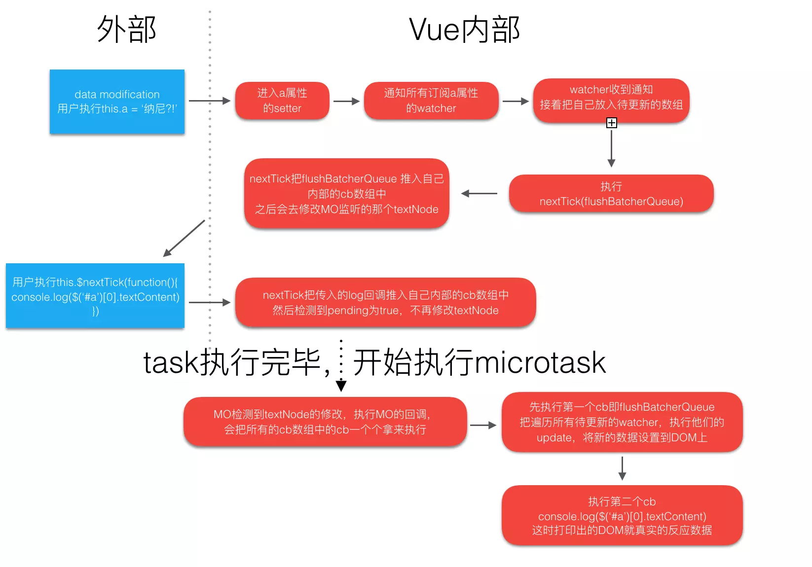

## 源码解析说明

### pending

本轮次是否已经执行过`timerFunc`。

### callbacks

存放回调 fn。

### timerFunc

执行 flushCallbacks 的异步任务，优先级为 Promise.then > MutationObserve > setImmediate > setTimeout

```js
if (typeof Promise !== "undefined" && isNative(Promise)) {
  const p = Promise.resolve();
  timerFunc = () => {
    p.then(flushCallbacks);
    // 有的UIWebView中Promise.then会被推进微任务队列，不会崩溃，但是队列不会被刷新，直到浏览器需要做其他工作，比如处理计时器的时候才会刷新。
    if (isIOS) setTimeout(() => {});
  };
  isUsingMicroTask = true;
} else if (
  !isIE &&
  typeof MutationObserver !== "undefined" &&
  (isNative(MutationObserver) ||
    MutationObserver.toString() === "[object MutationObserverConstructor]")
) {
  // PhantomJS, iOS7, Android 4.4中不支持Promise. ps: 真是涨知识了
  // MutationObserver 在 IE11 不支持
  let counter = 1;
  const observer = new MutationObserver(flushCallbacks);
  const textNode = document.createTextNode(String(counter));
  observer.observe(textNode, {
    characterData: true,
  });
  timerFunc = () => {
    counter = (counter + 1) % 2;
    textNode.data = String(counter);
  };
  isUsingMicroTask = true;
} else if (typeof setImmediate !== "undefined" && isNative(setImmediate)) {
  timerFunc = () => {
    setImmediate(flushCallbacks);
  };
} else {
  timerFunc = () => {
    setTimeout(flushCallbacks, 0);
  };
}
```

### flushCallbacks

执行本轮次中的回调 fn。

```js
function flushCallbacks() {
  pending = false;
  // 使用slice方法拷贝出callbacks，防止有些情况下callbacks会被添加新的回调。例如，在回调fn中有nextTick，这些应该属于下一轮次。
  const copies = callbacks.slice(0);
  callbacks.length = 0;
  for (let i = 0; i < copies.length; i++) {
    copies[i]();
  }
}
```

## Q&A

- `为什么优先使用 microtask，而不是 task？`  
  HTML中的UI时间、网络事件、HTML Parsing等都是使用task来完成的。

## 心得

记得最开始自己一直陷入一个盲区：`浏览器dom节点的更新是异步的，所以才有了nextTick`。直到看完源码的逻辑后方才醒悟过来，写原生 js 的时候什么时候异步获取过更新结果，更新从来都是同步执行的。nextTick 的出现是由于`Vue的Watcher触发的update是放入了待更新数组而后执行的nextTick`，这一操作导致了`Vue的更新dom是异步的，也正因如此才需要nextTick来实现在更新dom后执行操作`。

```js
this.$nextTick(() => console.log(el.innerText), 1);
this.elText = "change world";
console.log(el.innerText, 2);
this.$nextTick(() => console.log(el.innerText), 3);

// undefined, 2
// undefined, 1
// change world, 3
```

## 图解助消化




## 没用的小知识

由于MutationObserver在IOS9.3的UIWebView里有bug，所以尤大在2.0的rc版本里nextTick有一版使用了window.postMessage代替MO，即task，这导致了UI的task优先级要高，更新DOM操作出现延迟的现象。然后这一更改就被撤回了。


