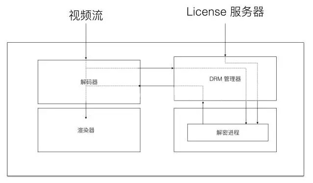

# MSE(Media Source Extension)

身为程序员，遇到自己喜欢的视频总是喜欢去控制台抓链接下载，但不知从什么时候起，各大网站的视频链接都变了个样子，基本都变成了**blob**开头的。**MSE** 就是应用流媒体来实现各种需求的一项技术。

## 简介

[MSE](https://developer.mozilla.org/zh-CN/docs/Web/API/Media_Source_Extensions_API) 提供了实现无插件且基于 web 的流媒体的功能。媒体串流可以通过 js 创建并使用 audio 和 video 元素进行播放。也可以用 js 把一些不支持的视频格式转为支持的格式，比如，flv.js 就是这种技术的典型实现，使用 MSE 将 flv 源用 js 实时转封装成 H5 支持的格式，又或者是对于视频清晰度的即时切换，动态更新音频语言等。

## 兼容性


## 基本概念

### fmp4(fragment mp4)


### Blob
Blob URL是一种伪协议，允许Blob和File对象用作媒体的URL源。
图片、视频、音频皆可以是 blob，**「在 JavaScript 中 Blob 类型的对象表示不可变的类似文件对象的原始数据。」**。

> ” <br/> MIME（Multipurpose Internet Mail Extensions）多用途互联网邮件扩展类型，是设定某种扩展名的文件用一种应用程序来打开的方式类型，当该扩展名文件被访问的时候，浏览器会自动使用指定应用程序来打开。多用于指定一些客户端自定义的文件名，以及一些媒体文件打开方式。常见的 MIME 类型有：超文本标记语言文本 .html text/html、PNG 图像 .png image/png、普通文本 .txt text/plain 等。<br/>
> “

### MediaSource

一个表示媒体资源`HTMLMediaElement`对象的接口。通过`URL.createObjectURL`方法生成一个和`MediaSource`绑定的临时 src。`MediaSource`对象通过自己的`SourceBuffer`集合从外部接收数据，然后将数据输入到`HTMLMediaElement`对象进行数据解析播放。JavaScript 可以自行通过`addSourceBuffer`接口添加。

**MediaSource**对象上主要有三个事件：
  - **sourceopen**：在给video的src赋值之后触发；
  - **sourceended**：在用户主动调用终止或视频数据解析、播放错误时触发；
  - **sourceclose**：在sourceBuffer和MediaSource中无可用数据时触发；


## 实现过程


从上图可以看出MSE的大致使用流程。首先，媒体服务器将完整的媒体文件拆分成视频和音频两个文件，然后再分别对两个文件进行切片。JS创建两个对应MIME类型的SourceBuffer，并添加到MediaSource的SourceBuffers中。然后客户端就可以按指定的顺序序列从媒体服务器请求资源片段，并调用sourceBuffer的appendBuffer方法将其添加入sourceBuffer。

当然，并不是随便一个mp4视频都可以支持MSE这种播放形式。很可能你会收到一个如下的报错：
> Uncaught DOMException: Failed to execute ‘endOfStream’ on ‘MediaSource’: The MediaSource’s readyState is not ‘open’.

这是由于该资源不是[fmp4](https://www.zhihu.com/question/314809922/answer/618733209)格式的。常用的转化工具有[Bento4 MP4](https://www.bento4.com/)，可以将普通MP4转为 fragmented mp4。


下面为官网给出的一个例子。

```JS
let video = document.querySelector('#player');
let ms = new MediaSource();
// 将video节的src与MediaSource实例绑定
video.srcObject = ms;
ms.addEventListener('sourceopen', sourceopen);
document.body.appendChild(video);

function sourceopen(e) {
  var mime = 'video/mp4; codecs="avc1.42E01E, mp4a.40.2"';
  var mediaSource = e.target;
  // 创建一个带有给定MIME类型的新的sourceBuffer并添加到MediaSource的sourceBuffers列表
  var sourceBuffer = mediaSource.addSourceBuffer(mime);
  var videoUrl = './video/movie.mp4';
  fetch(videoUrl).then(res => {
    return res.arrayBuffer();
  }).then(arrayBuffer => {
    // appendBuffer为异步执行的，所以需要此处监听事件，确定空闲后，再执行添加之后的逻辑
    sourceBuffer.addEventListener('updateend', function (e) {
      if (!sourceBuffer.updating && mediaSource.readyState === 'open') {
        // 当前总时长小于3分钟则重复添加视频
        if(MediaSource.duration < 180) {
          // 设定新chunk添加的位置
          sourceBuffer.timestampOffset = MediaSource.duration;
          // 添加新chunk
          sourceBuffer.appendBuffer(arrayBuffer);
        } else {
          // 结束流，将mediaSource.readyState改变为close，否则所有视频流播放完后播放器会继续呈现loading的状态
          mediaSource.endOfStream();
          video.play();
        }

      }
    })
    sourceBuffer.appendBuffer(arrayBuffer)
  })
}
```

注：

- video/mp4：代表这一段媒体资源的格式。一般情况下，可以通过 canPlayType 方法判断浏览器是否可以支持；
- codecs="avc1.42E01E, mp4a.40.2"：逗号之前一段，它用于告知浏览器关于视频编码的一些重要信息，编码方式、分辨率、帧率、码率以及对解码器解码能力的要求；逗号后面一段则代表视频的音频部分的编码信息。更加详细的描述可以查看[官方文档](https://link.zhihu.com/?target=https%3A//tools.ietf.org/html/rfc6381)

## 分段加载
依靠HTTP协议支持获取文件的部分内容这一特性，我们可以实现fmp4格式视频或其他类型文件的分段下载，主要依靠请求Headers中的**Range**参数，以及响应中的**Content-Range**参数实现。此时的请求状态值也不再是200，而是206（Partial Content）。这种应用技术最典型的例子就是断点续传。
```
<!-- Request -->
Rang: bytes=408689-490349
<!-- Response -->
Content-Range: bytes 6981640-7180713/34216175
```

## 码率自适应算法

最简单的算法：用上一段已加载完的 chunk 所用加载时长来决定下一个 chunk 的码率。不过这要求用户的网络非常稳定才有用。

市面上大多的实现方式：**Buffer-Based**算法。即**根据当前缓冲区中的视频长度决定下一个 chunk 的码率**。当然这个方法不适用于视频初始阶段的加载。

## 商业级视频资源加密播放

我司作为一家教育类互联网公司，商业级视频资源的加密是需要重点关注的。首先，介绍几个基本概念：
- CENC：通用加密标准(Common Encryption)。
- EME：加密媒体扩展（Encrypted Media Extensions），提供用于控制受数字限制管理方案约束的内容播放的接口。
- DRM：数字版权管理（Digital Rights Management），也可以解释为, 内容数字版权加密保护技术。
- CDM：内容解密模块（Content Decryption Module）。

下图为播放器的解码器、DRM和渲染器工作流程：



从图中可以看出DRM的解密内容一直在解码层，可以更好的防止被拦截，安全性大大提高。**CENC 没有规定授权的发放、授权的格式、授权的存储、以及使用规则和权限的映射关系等细节，这些细节的处理都由 DRM 提供商负责。**

解密流程大致可以描述为，浏览器基于媒体内容的元信息，判断加密的DRM的种类，并选择对应的CDM解密由CENC加密过的内容。各大浏览器厂商的DRM不尽相同，对此需要做的兼容也是一项比较繁重的挑战。

比较常用的DRM实现有clearkey、widevine和playready。其中clearkey加密内容的安全级别较低，keyId和key可以存在于js中，而widevine/playready则要求只能通过底层CDM协助，播放时从License服务器获取key，且无法复用。

加密视频数据同样可以使用前面提到的**bento4**来生成。


